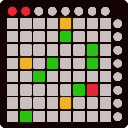
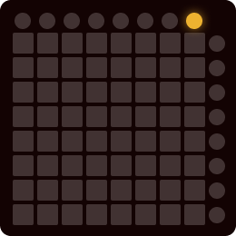
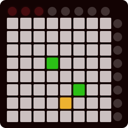
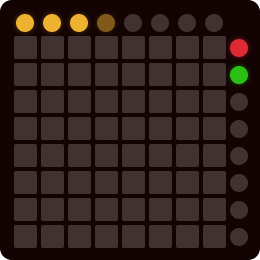

# Launchpad whack-a-mole

This is a simple game for the original Novation launchpad, it _might_ work
on newer launchpad models but I can't test it. This was a short project to
practice my programming, and to bring to life an old (but cool!) piece of
hardware that's been sitting at the bottom of my wardrobe for the best
part of ten years.



## How to use

In a terminal, navigate to this folder and run:

```
python3 game.py
```

You will be prompted to identify which MIDI device is your launchpad. Enter
the correct number and press the enter button. The 'mixer' button should
light up on your launchpad. When you're ready to play, press this button.



The rules of the game are:
- You must press each lit-up _square_ button within three seconds of it
  lighting up. The square will start green, and will change colours
  through brighter-green, orange, and brighter-orange before your time is
  up. If you don't press the button in the three-second window, you lose.
- You have three lives. If you press a button that _isn't_ lit-up, you lose
  one life. Once you have lost all your lives, any wrong move will end the
  game.
The goal is to press as many lit-up buttons as possible



On ending the game, you can choose to play again by pressing the 'pan'
button, or to exit the game by pressing the 'vol' button.



